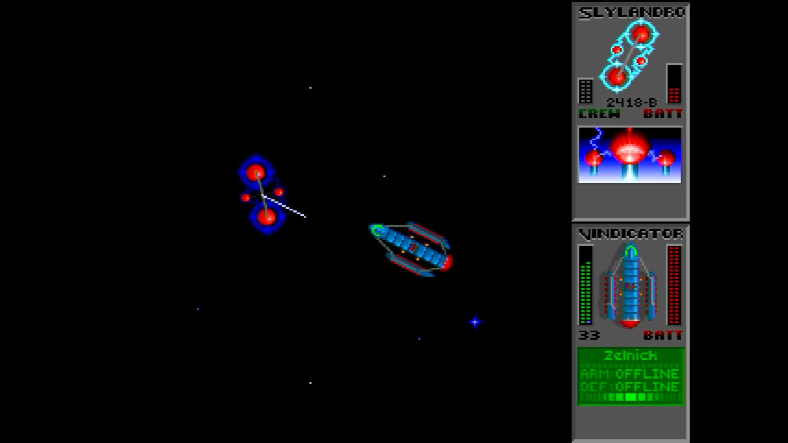
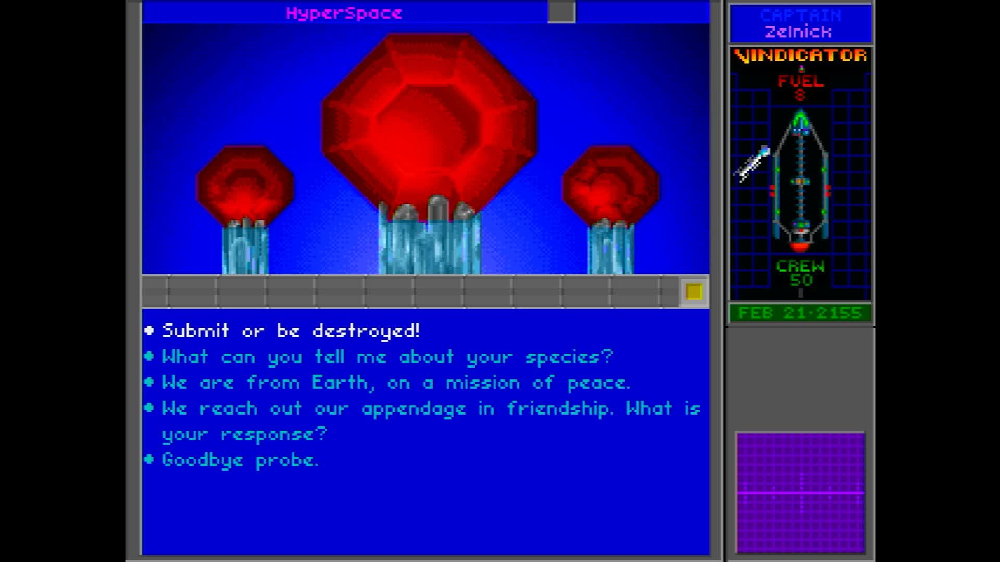

# pi-urquan

**The Ur-Quan Masters running directly on a Raspberry Pi with no operating
system.** The board powers on and the game is what boots: no Linux, no
desktop, no launcher, and nothing else running beside it.

It builds for the Raspberry Pi 3, Pi 4 and Pi 5, all three from one source
tree.



*Captured from the Pi 5's HDMI output — the Vindicator against a Slylandro
probe. The board is running this image and nothing else: no kernel underneath
it, no window system, no launcher.*



*The other half of the game: an alien on the comm screen and a list of things
to say to it.*

## What this is

[The Ur-Quan Masters](https://sc2.sourceforge.net) is the free software
release of Star Control II. Toys for Bob released the 3DO port's source and
content in 2002, and the project has maintained and ported it ever since.
This repository is the thin layer that lets it run with nothing underneath: a
[Circle](https://github.com/rsta2/circle) kernel that brings the board up, and
[circle-libsdl2](https://github.com/Xalior/circle-libsdl2), an SDL2
implementation built on Circle's bare-metal drivers.

The game's own source is not copied or modified here. It is a submodule,
pinned at an upstream commit, and the build reads it without ever writing to
it. The same is true of the four libraries the game needs — zlib, libpng,
libogg and libvorbis — which are submodules pinned at upstream release tags
and compiled into the kernel image alongside the game.

Where the game needs something SDL2 does not cover, this repository supplies
it in `host/`.

The game draws at 320x240, the size it has always drawn at, and the picture
is scaled once onto whatever your screen actually is.

## What works

The whole game, on all three boards: the star map and hyperspace, planets and
landers, ship-to-ship combat, the conversations, Super Melee.

- **Picture.** The full 320x240 rendering, scaled to your screen.
- **Sound.** Effects, the soundtrack, and — with the optional packages on the
  card — the 3DO remastered music and the voice acting.
- **Keyboard.** Menus, flight and combat.
- **Saved games and settings.** Written back to the SD card, so they survive
  a power cut.

Network play is the one thing missing; it is not built.

## What you need to supply

**This repository contains no game data**, and building the images does not
download any. `make media` is a separate step that fetches it.

The data *is* freely redistributable — that is the whole point of the
project — so unlike most ports, this one can fetch everything it needs:

```sh
make media
```

That downloads three files from The Ur-Quan Masters project's own SourceForge
releases, verifies each against a SHA256 and against the ZIP magic, and writes
a `provenance.txt` beside them:

| File | Size | What it is |
|---|---|---|
| `uqm-0.8.0-content.uqm` | 11 MB | The base game content. **Required** — the game cannot start without it. |
| `uqm-0.8.0-voice.uqm` | 115 MB | The 3DO port's voice acting. Optional. |
| `uqm-0.8.0-3domusic.uqm` | 19 MB | The 3DO port's remastered soundtrack. Optional. |

A `.uqm` package is a ZIP archive under a different extension. The game reads
it as one, so it is never unpacked.

The game code inside these packages is GNU General Public License version 2
or later; the resource content is Creative Commons BY-NC-SA 2.5. Both are the
project's own terms, published at <https://sc2.sourceforge.net>.

Re-running `make media` verifies what is already there rather than
downloading it again.

## Building

You need a Linux or macOS machine, GNU make, and the Arm GNU toolchain for
`aarch64-none-elf` (release 15.2.Rel1). Put its `bin` directory on your
`PATH`, or unpack it into `toolchains/` in this repository.

```sh
git clone --recursive https://github.com/Xalior/pi-urquan.git
cd pi-urquan
make deps       # long: builds newlib and libc++ from source, once per board
make kernels    # the three board images
make verify     # confirms each image exists and is not empty
```

`make deps` is the slow step, and it is slow once. It builds a complete C and
C++ world for each board, because each board's world is compiled for its own
processor.

Part of that world is libc++, whose sources are fetched from a git tag that
carries the bare-metal patches. One copy is enough for every board and for
every project on your machine, so tell the build where to keep it and it is
fetched once:

```sh
make deps CIRCLE_LLVM=/path/to/circle-llvm
```

The default puts that checkout beside this repository, which is the right
answer for a plain clone or a continuous-integration runner and needs no
setting at all.

The images land in `host/build/<board>/`:

| Board | Image |
|---|---|
| Pi 3 | `host/build/rpi3/kernel8.img` |
| Pi 4 | `host/build/rpi4/kernel8-rpi4.img` |
| Pi 5 | `host/build/rpi5/kernel_2712.img` |

Building one board on its own is `make rpi5`, and its dependencies alone are
`make deps-rpi5`, which is what a machine without room for three worlds
wants.

## Putting it on a card

```sh
make card
```

That stages the card into `build/sd-card/` for you to copy onto FAT32 media:
the three kernel images under the names each board's firmware looks for, the
boot configuration, and the game's own directory under `games/urquan/`.

`make card` downloads nothing. It copies in whatever `make media` left in
`media/` and names anything that is missing, so a card built without the data
step is a legitimate build that says exactly what it lacks.

The card layout is:

```
kernel8.img  kernel8-rpi4.img  kernel_2712.img
config.txt  cmdline.txt
games/urquan/content/version
games/urquan/content/menu.key  games/urquan/content/uqm.key
games/urquan/content/packages/uqm-0.8.0-content.uqm
games/urquan/content/addons/uqm-0.8.0-voice.uqm
games/urquan/content/addons/uqm-0.8.0-3domusic.uqm
games/urquan/config/
```

`content/version` is the marker the engine uses to recognise a content
directory at all, and `menu.key` and `uqm.key` are the keyboard bindings —
without them the game starts, draws and plays its music while ignoring every
key you press. None of the three is in the downloaded packages; `make card`
takes all of them from the game's own source tree.

One thing is not staged and has to be added by hand: **the Raspberry Pi
firmware files** — `bootcode.bin`, `start*.elf`, `fixup*.dat` and, for the
Pi 4, `armstub8-rpi4.bin`. Take them from a Raspberry Pi OS card or from the
[firmware repository](https://github.com/raspberrypi/firmware).

Everything this game reads or writes stays inside `games/urquan/`. A card
carries several games, and two of them writing settings into the card's root
would each silently overwrite the other's.

### Keeping it cool

The card carries `cmdline.txt`, which sets the temperature the board is
allowed to reach and the pin its fan is on:

    socmaxtemp=70 gpiofanpin=45

Pin 45 is the Raspberry Pi 5 Case Fan and Active Cooler. With a fan named,
reaching 70°C switches the fan on and the processor keeps running at full
speed. Without one it would be slowed down instead, and a slowed processor
drops frames.

If your fan is wired somewhere else, change the pin number.

## License

The code in this repository — the kernel layer in `host/` and the build — is
released under the GNU Lesser General Public License, version 3. See
[LICENSE](LICENSE).

The submodules are other people's work and carry their own terms, and all of
them matter before you distribute anything you build here:

- **The Ur-Quan Masters** is released under the GNU General Public License,
  version 2 or later.
- **Circle** is released under the GNU General Public License, version 3.
- **zlib** and **libpng** carry their own permissive licences; **libogg** and
  **libvorbis** carry the Xiph.Org BSD-style licence.

Building a kernel image here combines all of them, and the result is covered
by the GNU General Public License, version 3. Doing that for yourself is
straightforward; redistributing the result means satisfying every one of
those terms at once, including supplying complete source.

Star Control is a trademark of its respective owner. This project is not
affiliated with Toys for Bob, Accolade or Stardock.
